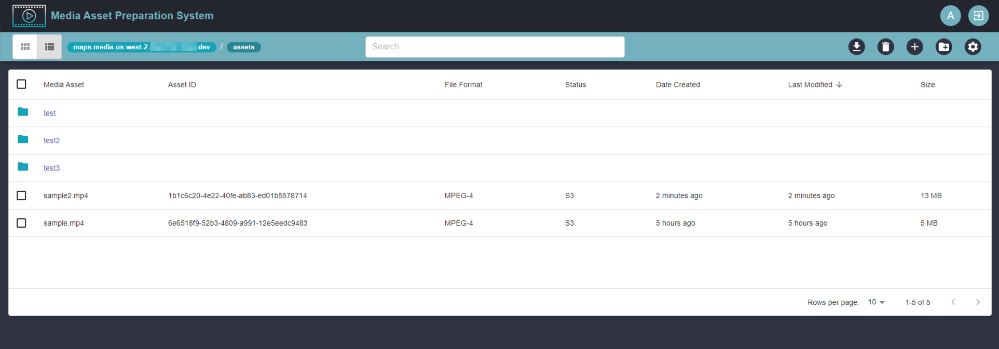

# AWS Media Asset Preparation System

The Media Asset Preparation System (MAPS) facilitates the preparation and movement of media assets across AWS storage mediums such as Amazon S3 and Amazon FSx. Anyone involved in preparing media for post-production workflows can upload and download media, search and filter assets, organize media into folders, preview media in the browser, and move media between Amazon S3 and Amazon FSx in preparation for downstream workflows. MAPS provides a simple user interface that can be accessed from the web browser and includes a set of foundational controls for interacting with the media to ensure the experience is intuitive and not a burden to users. MAPS is meant to address pain points involving uploading content to AWS, media preparation, media movement, permissions, search, filtering, and delivery of content and is not meant to be a replacement for an asset management solution.




## Requirements
Before you deploy, you must have the following in place:

* [AWS Account](https://aws.amazon.com/account/)
* Code repository (e.g. [GitHub](https://github.com/), [AWS CodeCommit](https://aws.amazon.com/codecommit/), [Bitbucket](https://bitbucket.org/product))
> If you plan to modify the code base, you will also need the following
* [Node 16 or greater](https://nodejs.org/en/download/)
* [Amplify CLI 12.0.0 installed and configured](https://aws-amplify.github.io/docs/cli-toolchain/quickstart#quickstart)
* [Python version 3.7 or greater](https://www.python.org/downloads/)

## Deploy the App

To automatically deploy the app, click the big orange button 👇

[](https://console.aws.amazon.com/amplify/home#/deploy?repo=https://github.com/aws-samples/aws-media-asset-preparation-system)

*Note: if you don't have an Amplify Service role, you will need to create one.*

> If you wish to manually deploy the app, follow the instructions below.
### Deploy the back end

1. Clone the repo & install the dependencies
```sh
~ git clone https://github.com/aws-samples/aws-media-asset-preparation-system.git
~ cd aws-media-asset-preparation-system
~ npm install
~ pip install pipenv
```

2. Initialize and deploy the Amplify project

```sh
~ amplify init
? Enter a name for the environment: dev (or whatever you would like to call this env)
? Choose your default editor: <YOUR_EDITOR_OF_CHOICE>
? Do you want to use an AWS profile? Y
? Enter the name of the group to which users will be added. editors
✅ Initialized your environment successfully.

Your project has been successfully initialized and connected to the cloud!

~ amplify push
? Are you sure you want to continue? Y
✅ GraphQL schema compiled successfully.

Suggested configuration for new layer versions:

MAPSMediaInfoLayer
  - Description: Updated layer version  XXXX-XX-XXXXX:XX:XX.XXXX

? Accept the suggested layer version configurations? Y

? Do you want to generate code for your newly created GraphQL API? N
```

### Deploy the front end

1. Create a new repository with your git service of choice

2. Push the project to your new repository

```sh
~ git remote add origin <your_new_repository>
~ git push --set-upstream <branch_name>
```

3. Connect to the [AWS Amplify Console](https://console.aws.amazon.com/amplify/home) and wait for the build & deploy process to complete. You will be given a production URL that you can use to interact with MAPS!

### Getting Started

Once MAPS is deployed, follow the [Getting Started](./docs/GettingStarted.md) guide to begin preparing media assets.


## Maintainer

Kim Wendt


## License

This library is licensed under the MIT-0 License. See the LICENSE file.
