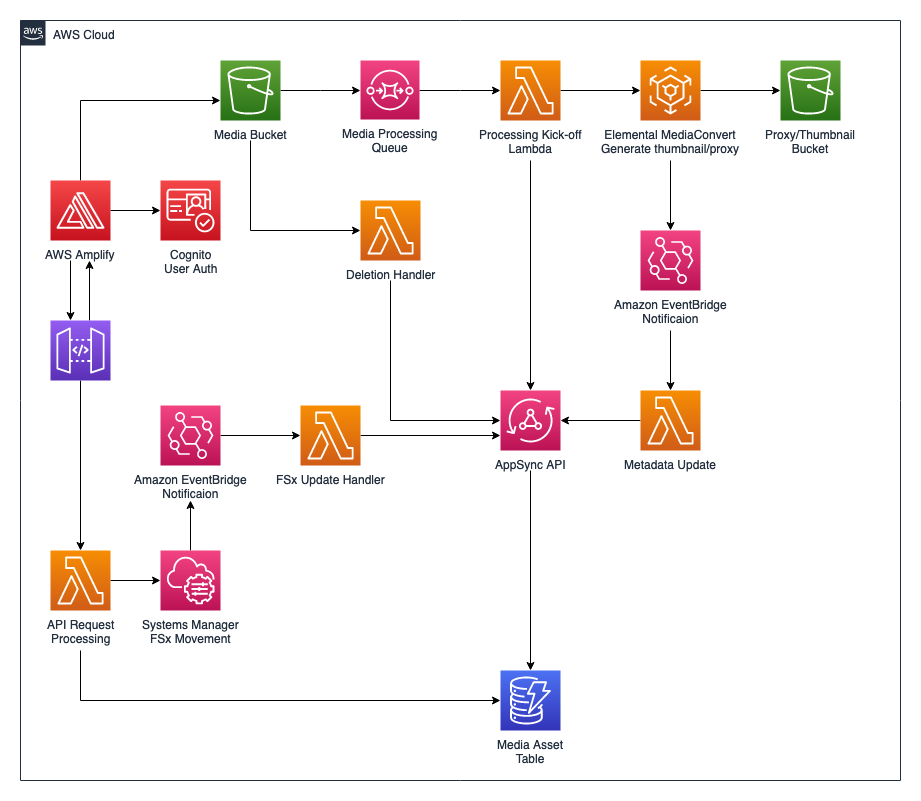
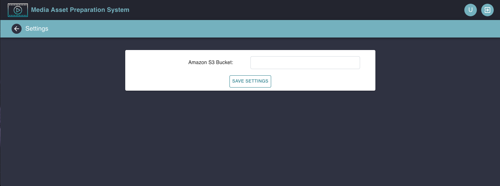
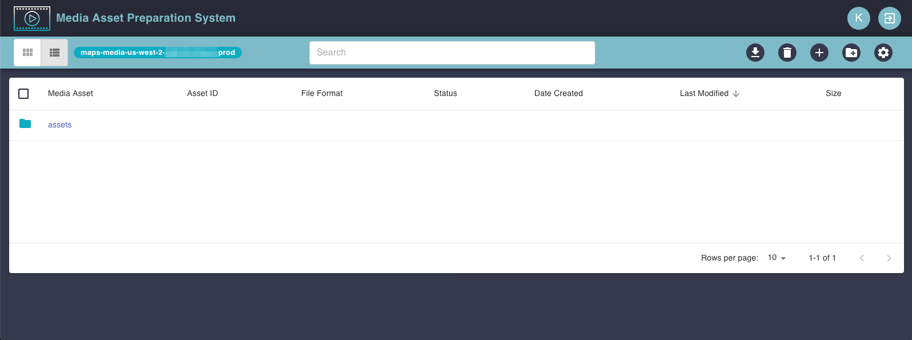
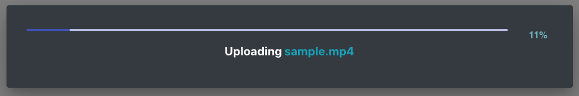
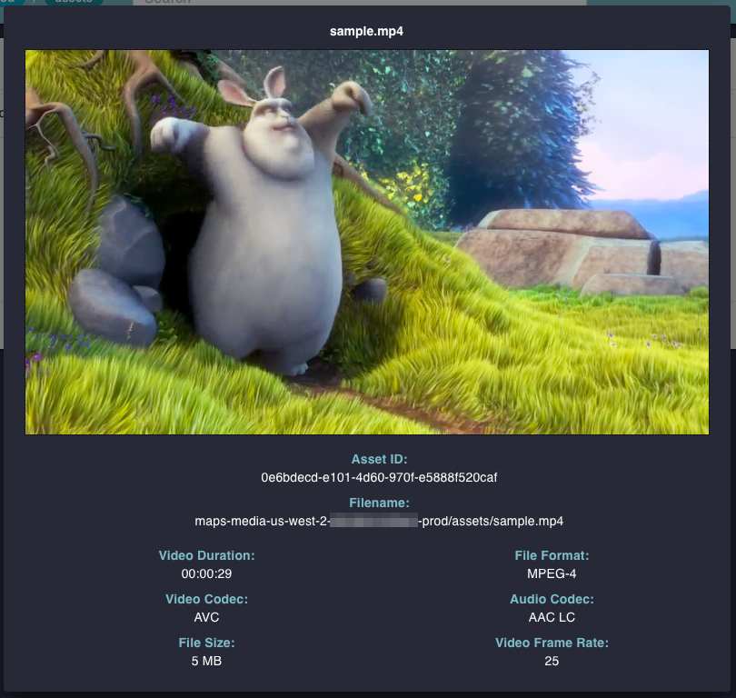
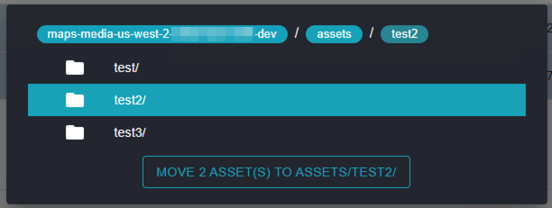
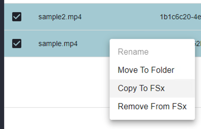

# Getting Started with MAPS
The Media Asset Preparation System deploys the architecture shown below and can be connected to an existing Edit in the Cloud deployment for post-production workflows.

## Configuration
> If you do not have an existing edit in the cloud deployment, you can deploy one from this [GitHub repo](https://github.com/aws-samples/aws-cloud-video-editing)

### Connecting Amazon FSx to MAPS
1. Retrieve your Amazon FSx for Windows File Server Mount ID from the console.
2. Navigate to the `MAPSApiProcessing-<your_env>` Lambda function, and update the `FSX_MOUNT` environment variable with the mount ID from the previous step. *Note: the environment variable should be of the form `\\mount_id\share`*

### Configure the Edit Instance
The back-end currently requires FSx movement commands to be initiated from an EC2 edit instance with a public, Elastic IP address.

1. Copy the `MoveMedia.ps1` script, located [here](../scripts/MoveMedia.ps1), to the following directory on the EC2 instance: `C:\ProgramData\Amazon\EC2-Windows\Launch\Scripts`
2. Ensure that the SSM Agent is installed on the edit instance, and the instance profile has the `AmazonEC2RoleforSSM` policy attached.

### Create an Admin User
By default, all new users who register using the Sign-In page will be added to the editors group.

1. To create an admin user, navigate to the Amazon Cognito User Pools console and select `mapsuserpool-<your_env>`
2. Click on Users and Groups, then select Create user.
3. Fill in the required information and click Create user.
4. Click on the newly created user, and select Add to group.
5. From the drop down, select admin, and select Add to group.

### Configure the MAPS Interface
By default, the MAPS deployment creates an empty S3 media bucket for use with the interface. You can retrieve this bucket name by navigating the the AWS CloudFormation stack beginning with `amplify-maps-<your_env>-<your_app_id>-resMAPS`, selecting the **Outputs** tab, and copying the `MediaBucketName` value.

1. Navigate to the AWS Amplify console and retrieve the production URL for your Amplify deployment.
2. Remotely connect to your EC2 edit instance via RDP or Teradici following the instructions in this [blog post](https://aws.amazon.com/blogs/media/getting-started-with-aws-cloud-video-editing/).
3. Open a web browser on the instance (Chrome is preferred), and go to the Amplify URL from step 1.
4. You will be prompted with a sign-in page. You should use the admin user you created in the previous section. *Note: you will be prompted to change your password, and may also be prompted to enter an email for account recovery purposes*
5. Once logged in, you will see the MAPS interface (shown below).

6. To configure the interface, click on the gear icon in the controls toolbar.
7. On the settings page, enter the `MediaBucketName` and click **Save**, then click the back arrow to return to the main view.

8. The MAPS interface is now be configured, so let's add some folders and media assets.

### Creating folders & uploading assets
1. To add a folder, click the Add Folder button in the controls toolbar. Enter a name for the folder and click Create Folder. *Note: to navigate between folders, simply click on the table row.*

2. To upload a media asset, click on the New File button in the controls toolbar. Click Browse, then select the media file you wish to upload. Finally, click upload. A progress bar will appear to keep you updated on the status of your file upload.

3. Once your upload is complete, the MAPS backend will begin processing the asset and within a few minutes, you will be able to preview your asset in the browser by double clicking on the table row.

### Moving media
1. To move media between folders, select all the assets you wish to move.
2. Right click on one of the rows and select Move to Folder.
3. Select which folder to move the assets to, then click the button.

*Note: It may take a few minutes to move your media assets to their new location.*

4. To copy media from Amazon S3 to Amazon FSx, select all the assets you wish to move.
5. Right click on one of the rows and select Copy to Fsx.

*Note: This operation must be performed from an EC2 instance configured as described above. It may take a few minutes to copy the files from S3 to FSx.* 

6. When you no longer need the media assets in Amazon FSx, select the assets you wish to remove from Fsx.
7. Right click on one of the rows and select Remove from FSx.

## Folder permissions
By default, there are two permission groups when you deploy MAPS: admin and editors. When a user creates a folder, the folder and all assets within it inherit that user's group permissions. The admin group is automatically added to all new folders as well. Users in the admin group are the only ones who can update the permissions of a given folder. Adding more groups must be done in the Amazon Cognito console.

1. Right click on the folder you wish to change permissions for and click on Permissions.
2. Select or unselect the groups to give permission to and click Save. *Note: you won't be able to fully remove the admin group permissions*
